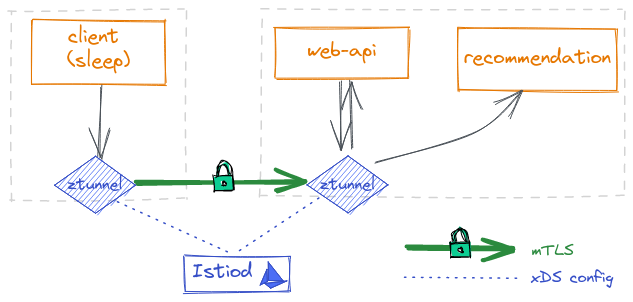
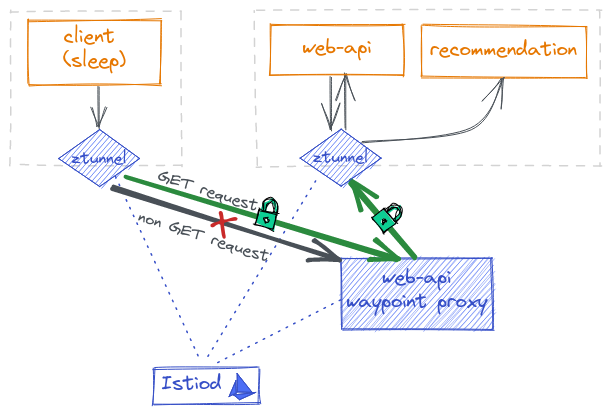

# bsides-krakow-2023
Repo for Ambient Mesh demo at BSides Krakow 2023

You can follow along with the demo by running your demo environment here: https://play.instruqt.com/soloio/invite/rw9jo7ixgphs (valid for 7 days from 2021-09-22).

The following instructions are slightly different from the workshop, as they use a newer version of Istio and add monitoring capabalities with Kiali, Prometheus and Grafana. Slides can be found [here](https://docs.google.com/presentation/d/1g9IH--EvBm7DTLfMIjiggV9lCRMEeGVqEi5yEI7dmlA/edit?usp=sharing).

## Prerequisites

- `Helm` and `kubectl` installed
- `istioctl` installed and at 1.9.0 or higher
- `stern` for logs (https://github.com/stern/stern)
- A Kubernetes cluster with a CNI plugin (but NO Cilium, yet), preferebly in Azure, tested with Kubernetes version 1.27.3
  
## Install Istio

```bash
bash manifests/install-istio-ingress-egress.sh
```

## (Optional) Configure Azure DNS with wildcard)

You'll need a DNS zone in a resource group called `dns` (or change the script). The script will create a wildcard record pointing to the Istio ingress gateway.

```bash
export GATEWAY_IP=$(kubectl get svc -n istio-system istio-ingressgateway -ojsonpath='{.status.loadBalancer.ingress[0].ip}')
export DOMAIN_NAME="k8s.computer"
export DNS_RG="dns"

az network dns record-set a delete -g ${DNS_RG} -z ${DOMAIN_NAME} -n '*' -y
az network dns record-set a add-record -g ${DNS_RG} -z  ${DOMAIN_NAME} -n '*' -a $GATEWAY_IP
dig any.${DOMAIN_NAME} +short
```

## Install the demo app

```bash
APP_NAMESPACE=test
kubectl create ns ${APP_NAMESPACE}
kubectl apply -n test -f manifests/app/
```
## Test the app without the mesh

```bash
kubectl -n test exec deploy/sleep -- curl -I -s  http://web-api:8080/ | grep OK
```

Expose the Web API thru the ingress gateway

```bash
kubectl apply -n ${APP_NAMESPACE} -f manifests/expose-app/expose-app-gw.yaml
```

Test it

```bash
curl -I -s http://web-api.${DOMAIN_NAME}/ | grep OK
```

## Onboard app to Ambient

Label the namespace and voila'!

```bash
kubectl label namespace test istio.io/dataplane-mode=ambient
```

Notice how the pods keep running without disruption!

Check the logs of `istio-cni` to check the routes have been added:

```bash
stern -n istio-system istio-cni
```

Let's set up some monitoring now:

## Monitor Istio and proxies

Install Kiali and Prometheus+Grafana

```bash
bash manifests/helm-install-kiali.sh
bash manifests/install-prometheus.sh
```

```bash
kubectl apply -f manifests/svcmon-podmon-istio.yaml
kubectl apply -f manifests/dashboard.yaml
```

The above setups two ServiceMonitor for the istio-ingressgateway and the control plane, and two PodMonitors
for the ztunnel and the istio-proxies (in case you want to run both sidecar and sidecarless mode).

## Expose Monitoring Services
Expose the monitoring services to the outside world (beware, no authentication is configured!)

```bash
kubectl apply -f manifests/kiali-gw.yaml
kubectl apply -f manifests/grafana-gw.yaml
kubectl apply -f manifests/prometheus-gw.yaml
```

## Check the traffic flowing thru the ztunnel

Generate traffic
```bash
sh traffic-gen.sh
```

Open Grafana and Prometheus and check the dashboards. These are some queries you can try:

```promql
- `istio_requests_total{destination_service="web-api.test.svc.cluster.local"}`
- `rate(istio_tcp_received_bytes_total{destination_app="web-api"}[5m])``
```

## L4 Authorization Policies

Deploy a deny all policy for everything in the test namespace:



```bash
kubectl apply -n ${APP_NAMESPACE} -f manifests/policies/deny-all.yaml
```

Requests are now blocked:

```bash
curl -H "Host: web-api.${DOMAIN_NAME}" "http://${GATEWAY_IP}/"
```

Allow some traffic in:

```bash
kubectl apply -n ${APP_NAMESPACE} -f manifests/policies/allow-sleep.yaml
```

Requests are now allowed:

```bash
curl -I -H "Host: web-api.${DOMAIN_NAME}" "http://${GATEWAY_IP}/"
```
## L7 Authorization Policies

Let's go beyond L4 with L7 policies



```bash
kubectl apply -n ${APP_NAMESPACE} -f manifests/l7/waypoint.yaml
```

Check the new waypoint proxy pod (running `envoy`) in the `test` namespace:

```bash
kubectl -n test get pods -l istio.io/gateway-name=web-api
kubectl -n test get pods -l istio.io/gateway-name=web-api -o jsonpath='{.items[].spec.containers[0].image}'
```


Allow the `sleep` app to access the `web-api`:

```bash
kubectl apply -n ${APP_NAMESPACE} -f /manifests/l7/allow-sleep-l7.yaml
```

Check that now you can send a GET request but not a DELETE call:

```bash
kubectl -n test exec deploy/sleep -- curl http://web-api:8080/
kubectl -n test exec deploy/sleep -- curl http://web-api:8080/ -X DELETE

RBAC: access denied
```

Stay tuned for Fault injection and Traffic shaping!